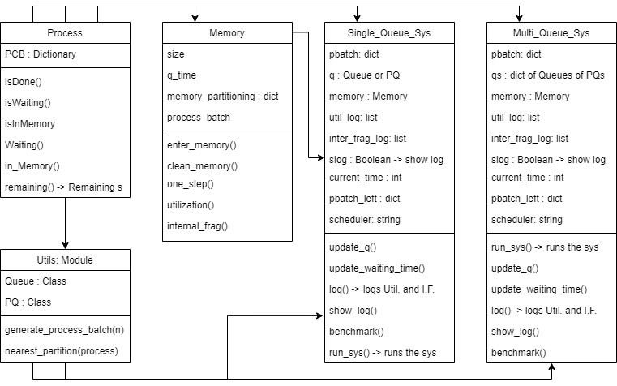
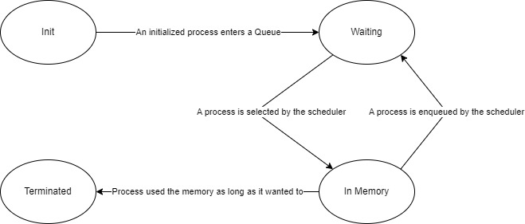

# Memory Assignment for an Unequal Fixed Partitioning system

---
## Overview
 In *Chapter 7* (Called *Memory Partitioning*) *Section 3* of the famous book **Operating Systems:
 Internals and Design Principles**, 
There is an explanation about different types of partitioning and also
 different ways of *Memory Assignment for Fixed Partitioning* which are:
- **Single Queue**
- **One Process Queue per Partition**

I Simulated both systems and compared them together with two different schedulers
(For more information, check *Chapter 9*):
- **RR :** Round Robin
- **SRT :** Shortest Remaining Time

---
## A Little(Noghli) Class Diagram
First of all, we can interpret the word *Noghli* as *Little* in Farsi :)

Here is the Class diagram of my implementation: 

---
## Process Class

The main component of a process is *PCB* (*Process Control Block*).

I tried to bring this idea into my implementation.
The PCB property of the Process class is actually a Simplified representation of a Process's PCB in OS.

The Keys of the PCB property are as follows:

- `PID` (Process ID)
- `size` (Size of the Process)
- `Request Memory Time`
- `Service Time`
- `Waiting Time`
- `Arrival Time`
- `Status`

### State Diagram of a Process object

---
## Results of the Simulation
Here is the Result of my simulation where you can find the code of, in `main.py`.

The simulation is between different types of partitioning and also
 different ways of *Memory Assignment for Fixed Partitioning* and two different schedulers,
with three benchmarks which are:
- Average Response Time
- Average Memory Utilization
- Average Internal Fragmentation

**The x-axis is the number of processes that are given to the system**

---

 